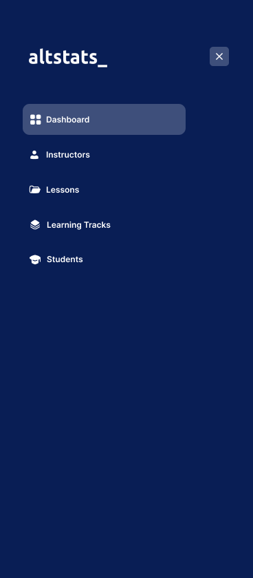
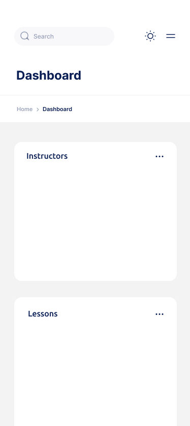
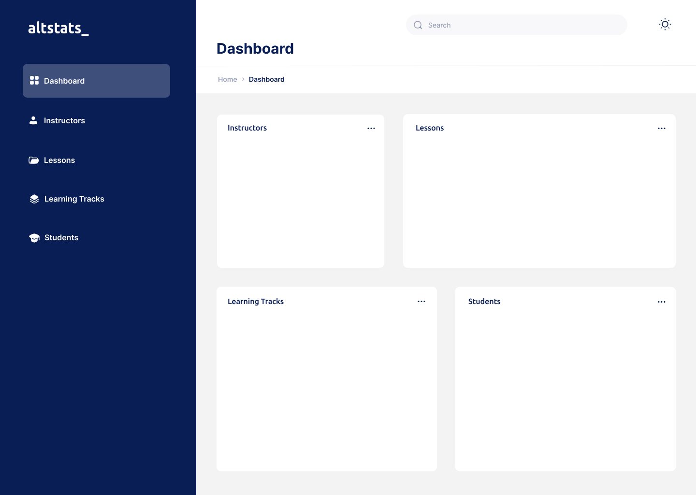

# altschool-stats-app
A dashboard stats app for an Altschool Africa challenge using HTML, CSS & Vanilla JS

<!-- TABLE OF CONTENTS -->

## Table of Contents

- [Overview](#overview)
- [Built With](#built-with)
- [Features](#features)
- [Reach Me](#contact)

<!-- OVERVIEW -->

## Overview

#### Mobile View
 

#### Desktop View

This is a my personal demo of an holiday challenge by Altschool Africa. It's one of the team projects for the Hackathon which every circle of Altschool Africa's students have been asked to participate in. Yes, we have groups and they are cooly called "circles".

The idea is to build a dashboard to show the following stats and summaries

    - How many courses a given instructor is taking
    - How many students are in each of the tracks (frontend, backend and cloud)
    - How many students are male, female or other genders/orientation
    - Minimum, maximum, and average age of students in the school

Disclaimer: The details used for the stats in this project would represent nth close to accurate details, yet, I must build my project.

I intend to build this with HTML, SCSS and Vanilla JS

### Demo
You can view the demo for for this to-do app [here](https://#)

### Experience
- W-I-P

### Learning & Improvements
- W-I-P

## Built With

<!-- This section should list any major frameworks that you built your project using. Here are a few examples.-->
- [Vanilla JS](https://javascript.com/)
- [BEM Architecture](https://en.bem.info/)
- [SASS]()

## Features

<!-- List the features of your application or follow the template. Don't share the figma file here :) -->

## Reach Me

<!-- - Website [pearlsky.super.site](https://pearlsky.super.site) -->
- GitHub [@pearlsky](https://github.com/@pearlsky)
- Twitter [@godaffected](https://twitter.com/godaffected)